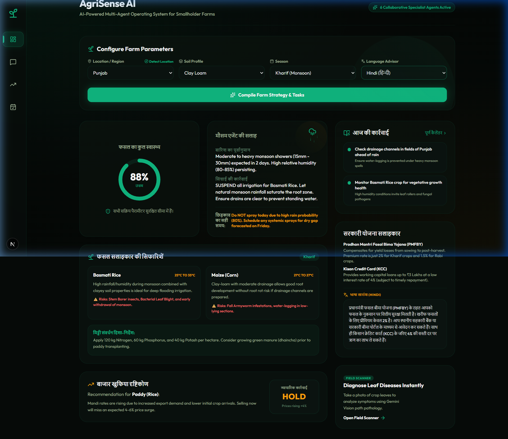
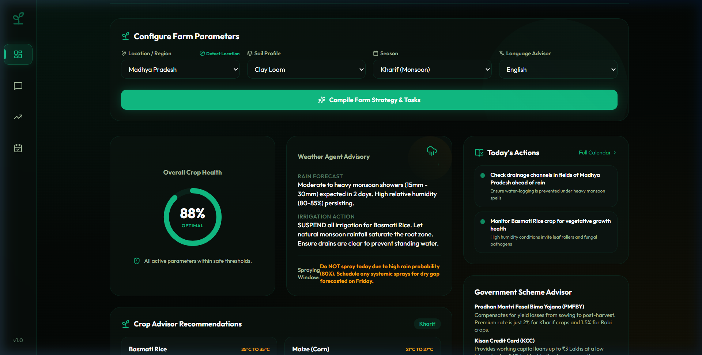

# 🌱 AgriSense AI
### Collaborative Multi-Agent Operating System for Smallholder Farms

AgriSense AI is an intelligent farm orchestration platform that empowers smallholder farmers by bringing together a collaborative team of AI agents. Powered by **Google Gemini 2.5 Flash** and orchestrated via **LangGraph**, these agents work together to compile crop recommendations, diagnose leaf diseases, coordinate irrigation schedules with weather forecasts, analyze local APMC mandi price indices, and translate complex government policies.

---

## 🛠️ System Architecture

AgriSense AI leverages a state-sharing multi-agent graph where specialized agents compile insights sequentially, passing structured JSON payloads to down-line specialists. The workflow culminates in the **Action Planner**, which consolidates the team's recommendations into an interactive checklist.

```
       +---------------------------------------------+
       |   User Context (Region, Soil, Season)       |
       +--------------------+------------------------+
                            |
                            v
               +------------+------------+
               |   1. Crop Advisor       | <--- Recommends crops & soil tips
               +------------+------------+
                            |
                            v
               +------------+------------+
               |   2. Disease Doctor     | <--- Identifies leaf pathogen reports
               +------------+------------+
                            |
                            v
               +------------+------------+
               |   3. Weather Specialist | <--- Schedules irrigation & spray timing
               +------------+------------+
                            |
                            v
               +------------+------------+
               |   4. Market Intelligence| <--- Fetches APMC rates & SELL/HOLD verdict
               +------------+------------+
                            |
                            v
               +------------+------------+
               |   5. Govt Scheme Liaison| <--- Checks subsidies & translates policies
               +------------+------------+
                            |
                            v
               +------------+------------+
               |   6. Action Planner     | <--- Compiles todo items & syncs to DB
               +------------+------------+
                            |
                            v
       +--------------------+------------------------+
       |   Unified Farm Calendar / Interactive Task DB|
       +---------------------------------------------+
```

---

## ✨ Features

### 1. Merged AI Chat & Disease Scanner UI
- Unified the standalone Leaf Scanner page natively inside the **AI Chat & Scanner** console.
- Farmers can upload leaf photos directly in the chat window via file upload or quick-test samples (e.g. Tomato Blight, Potato Leaf) to run **Gemini Vision pathology diagnosis**.
- Returns a beautifully structured diagnosis card displaying the disease name, confidence score, pathogen causes, prescribed organic/chemical treatments, and long-term prevention rules.
- Fully integrated with the multi-agent execution pipeline.

### 2. Location-Aware Dynamic Weather Forecasts
- Weather advisories automatically adjust based on the selected region/state and season.
- Custom logic divides 11 Indian agricultural states into regional climatic zones (North, Central/East, West, South) to output distinct weather guidance, temperature bounds, rain advisories, and spraying windows.
- The weather card renders dynamic CSS micro-animations: falling raindrops for the **Kharif** monsoon season, and a spinning, glowing sun with wind lines for **Rabi/Zaid** seasons.

### 3. Localized Translation Controls
- Added multi-lingual dashboard translations supporting **Hindi, Punjabi, Marathi, Telugu, and English**.
- **Intuitive UX Separation**: The main farm configuration panel, parameter inputs, state selectors, and the top navigation header always remain in English to avoid form inputs overlapping or deforming.
- All recommendations, strategy cards, today's actions, and government policies below the parameter form translate instantly into the selected regional language.

### 4. Smart Geolocation Mapping
- Includes a **Detect Location** button utilizing the browser's Geolocation API.
- Automatically maps coordinates (Latitude/Longitude ranges) to the closest supported Indian agricultural state (e.g. mapping southern coordinates to Tamil Nadu or Karnataka, eastern to Bihar, etc.) and auto-selects it in the Region dropdown.

### 5. Persistent Farm Strategy Caching
- Prevents database clearing/overwriting on page transitions.
- Farm configurations (Region, Soil, Season, Language) and compiled agent reports are cached client-side in `localStorage`, maintaining state seamlessly when transitioning between pages.

---

## 📸 Screenshots & Working Demo

### English Configuration Panel & Hindi Recommendations


### AgriSense Dashboard Overview


### 🎥 Working Demo Walkthrough


---

## 🚀 Setup & Installation

Follow these steps to run AgriSense AI locally:

### 1. Prerequisites
- **Python**: v3.10 or higher
- **Node.js**: v18 or higher
- **Gemini API Key**: Retrieve yours from Google AI Studio.

---

### 2. Backend Installation (FastAPI)

1. Navigate to the backend directory:
   ```bash
   cd backend
   ```
2. Create and activate a virtual environment:
   ```bash
   # Windows (PowerShell)
   python -m venv .venv
   .venv\Scripts\Activate.ps1

   # macOS/Linux
   python3 -m venv .venv
   source .venv/bin/activate
   ```
3. Install dependencies:
   ```bash
   pip install -r requirements.txt
   ```
4. Create a `.env` file from the example:
   ```bash
   cp .env.example .env
   ```
   Open `.env` and fill in your Gemini Developer Key:
   ```env
   GEMINI_API_KEY=AIzaSy...your_gemini_key
   ```
5. Run the FastAPI dev server:
   ```bash
   uvicorn backend.main:app --reload
   ```
   The backend will start on **`http://localhost:8000`**.

---

### 3. Frontend Installation (Next.js & Tailwind 4)

1. Navigate to the frontend directory:
   ```bash
   cd frontend
   ```
2. Install package dependencies:
   ```bash
   npm install
   ```
3. Run the Next.js dev server:
   ```bash
   npm run dev
   ```
   The frontend will launch on **`http://localhost:3000`**.

---

## 🛡️ License

This project was built for the **Kaggle 5-Day Intensive Vibe Coding Event with Google**.
Licensed under the MIT License.
